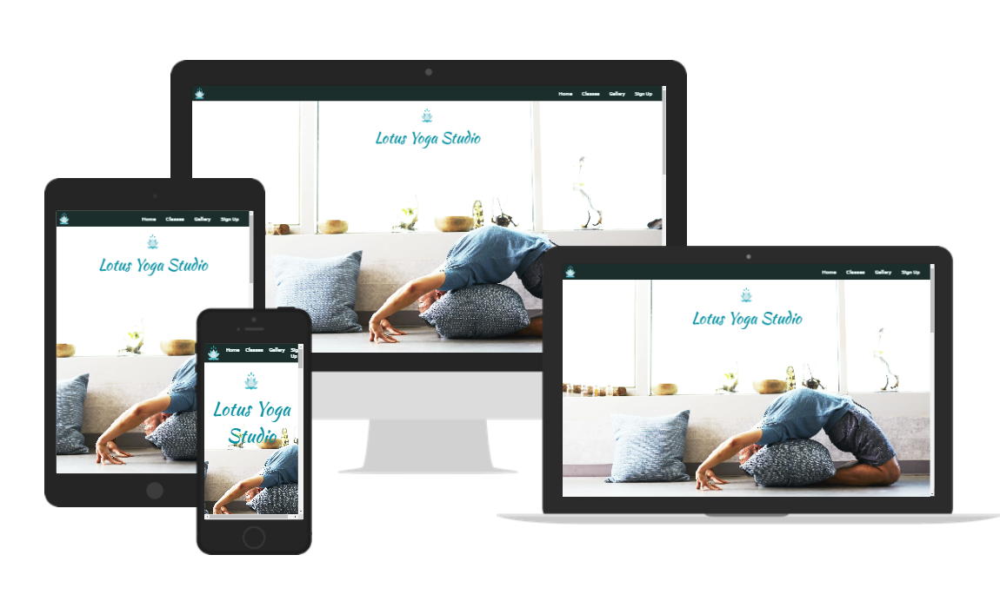

# LOTUS YOGA STUDIO

Lotus Yoga Studio is a landing page where people can join our yoga classes that show them the correct way to practice yoga poses while learning about how yoga can be used to manage stress, improve the mind-body connection, and increase strength and flexibility.

Users of this website will be able to find alll the information they need to know about Lotus Yoga Studio: About the Studio, classes times, contact information and a sign up form. This site is targeted towards anyone who want to learn and practice yoga.

## Features

### Navigation

Featured at the top of the page, the navigation shows the Studio's logo in the left corner which represents a lotus flower, as in the Studio's name: Lotus Yoga Studio.
The other navigation links are to the right: Home, Classes, Gallery and Sign up which link to different sections of the same page.

The navigation is in a font that looks like a basic, familiar font and a color that contrasts with the background.
The navigation clearly tells the user the name of the club and website and makes the different sections of information easy to find.

### The header

The header shows the logo of the club, using the other color chosen: Blue.

The section provides the user with clear information about what the site is and who the Studio it is for. 

The About Us Section
The About Us Section gives details about what the Studio offers their members and it has a button that sends the users to join the classes.
This section shows the user the important information they need to know about the Studio: What they offer and where they can join classes.

### HOME page

#### The About Us Section

The About Us Section gives details about what the Studio offers their members and it has a button that sends the users to join the classes.

This section shows the user the important information they need to know about the Studio: What they offer and where they can join classes.

#### The Benefits Section

The Benefits section gives details about what the yoga practice offers and about how it can improve your health. Also it offers some posing advice in order to improve the health of yoga practitioners.

#### About Modern Yoga section
This section offers information about yoga's history and how yoga spread during the years.

### CLASS page

The classes page provides an overview of the studio's yoga classes with their respective details:
* Instructor
* Number of Lessons
* Number of Students 

The weekly schedule of the classes is shown as a table under the list of types of classes.

### GALLERY page

This page shows a gallery of images from different classes and yoga workshops.

### Sign UP page

This page provides a sign-up form to Lotus Yoga Studio's classes. The user can enter his:
* first name
* last name
* email address 

and select the class he would like to join:

* Yoga for Beginners
* Hot Yoga
* Meditation Yoga
* Pure Alignment

### Quotes Section

### The Contact Section

The contact section encourages users to get in contact and provides a phone number, email address and street address where the Studio can be found.

The contact section includes social media icons so users can find the Lotus Yoga Studio on facebook, twitter, youtube and instagram.
The contact section is valuable to the user as it gives them the ability to find and contact the Lotus Yoga Studio if they need to.

## Testing

I tested that this page woks in different browsers: Chrome, Firefox, Safari.

I confirmed that this project is responsive, looks good and functions on all standard screen sizes using the devtool device toolbar.

I confirmed that the navigation, header, home page, classes page, gallery page and sign up page are all readable and easy to understand.

I have confirmed that the form works: requires entries in every field, will only accept an email in the email field, and the submit button works.

## Bugs
### Solved Bugs
*  When I deployed my project to GitHub Pages, I discovered my project was broken, the links to the other pages did not work. I discovered this was because I had used absolute file paths such as this in my code:

`<link rel="stylesheet" href="/assets/css/style.css">`

`<li><a href="/index.html">Home</a> </li>`

Removing the starting / fixed the problem.

* When loading the Gallery or the Home page, images were taking a long time to load. The fix was to downscale the images and convert them to Webp format.

## Validator Testing
* HTML 
  * The verifier detected a few section tags that did not have headings. To fix was to convert the section tags to normal divs.
  * The verifier detected a few extra closing `</i>` tags. The fix was to remove them.
  * No further errors were detected.

* CSS
  * The CSS Validator is currently offline.

* Accesibility
  *  I confirmed that the colors and fonts chosen are easy to read and accessible by running it through lighthouse in devtools.

Lighthouse Score for Desktop size
   

Lighthouse Score for Mobile size
   

## Unfixed Bugs

No unfixed Bugs.

## Deployment

The site was deployed to GitHub pages. The steps to deploy are as followers:
1. In the GitHub repository, navigate to the Settings tab.
2. Navigate to the Pages section.
3. From the Build and Deployment section, select the Main Branch as the source.
4. Deployment workflow should start.

## Credits
### Content 

The code to make the social media links was taken from the CI Love Running project.

The Benefit section was inspired by:

 *  [9 Benefits of Yoga](https://www.hopkinsmedicine.org/health/wellness-and-prevention/9-benefits-of-yoga)

 *  [13 Benefits of Yoga](https://www.healthline.com/nutrition/13-benefits-of-yoga#TOC_TITLE_HDR_3)

 The About Modern Yoga section was inspired by:
  *  [Modern Yoga](https://en.wikipedia.org/wiki/Modern_yoga)

The code to make the Sign Up form was inspired by the CI Love Running project.

### Media
The image above the footer was taken from [Yoku theme](https://demo.goodlayers.com/yoku/demo1/).

The fourth of the instructors image was taken from [Pexels](https://www.pexels.com).

The other images were taken from [Unsplash](https://www.unsplash.com).

